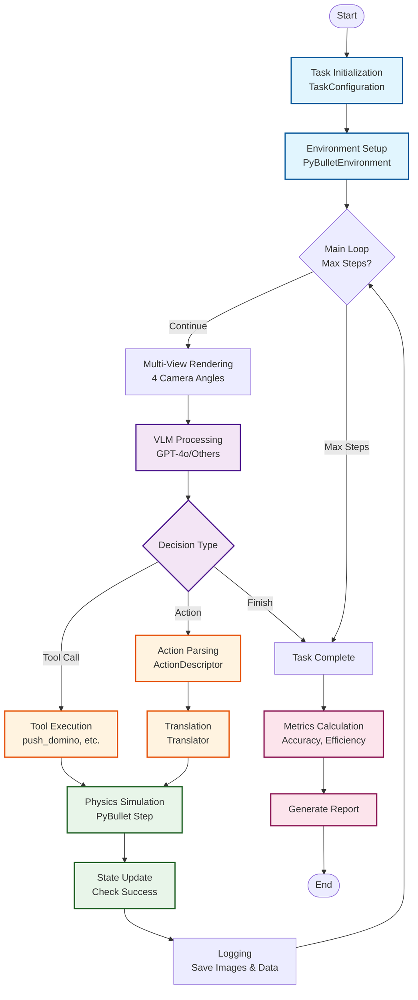
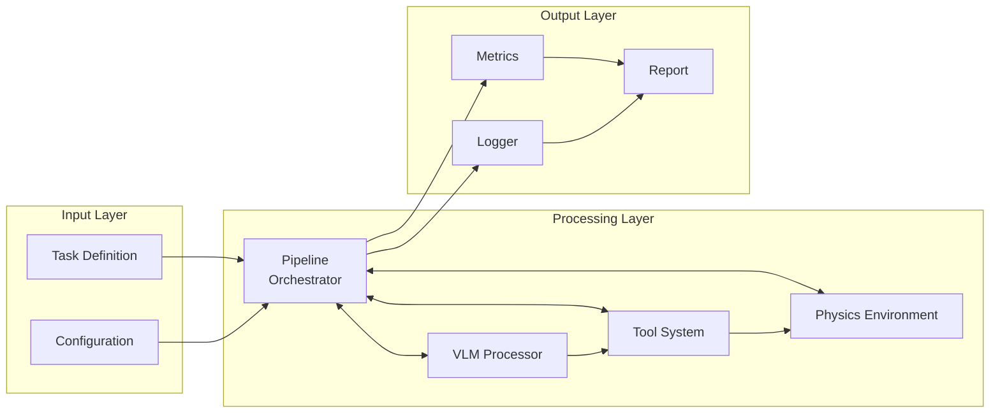

# VisualReasonBench - PhyVPuzzle Framework

> A comprehensive benchmark for evaluating physical visual reasoning capabilities of Vision-Language Models (VLMs) through interactive 3D physics simulation.

## 📋 Table of Contents

- [Overview](#-overview)
- [Quick Start](#-quick-start)
- [Architecture](#-architecture)
- [Core Components](#-core-components)
- [Directory Structure](#-directory-structure)
- [Task System](#-task-system)
- [Metrics & Evaluation](#-metrics--evaluation)
- [Logging System](#-logging-system)
- [Development Guide](#-development-guide)

## 🎯 Overview

PhyVPuzzle integrates state-of-the-art Vision-Language Models with realistic physics simulation to evaluate AI's ability to:
- **Perceive** physical scenes through visual input
- **Reason** about physical interactions and causality
- **Plan** action sequences to achieve goals
- **Execute** through structured tool calling
- **Judge** task completion through visual inspection (VLM-based)

### Key Features

- ✅ **Multi-View Rendering**: 4 camera angles (top, front, front-top, side) for comprehensive scene understanding
- ✅ **Tool-Based Interaction**: Structured function calling API for precise action execution
- ✅ **VLM Completion Checking**: Models determine task success by visual inspection, not hardcoded rules
- ✅ **Comprehensive Metrics**: Accuracy, Pass@K, efficiency, and token usage tracking
- ✅ **Detailed Logging**: Complete experiment tracking with multi-view image capture
- ✅ **Modular Design**: Easy to extend with new tasks and models

## 🚀 Quick Start

### Installation

```bash
# Clone repository
git clone https://github.com/your-org/VisualReasonBench.git
cd VisualReasonBench

# Install dependencies
pip install -r requirements.txt
pip install tiktoken  # For token counting
```

### Environment Setup

```bash
# Configure API credentials
export OPENAI_API_KEY="your-api-key"
export base_url="https://your-api-endpoint/v1"
```

### Minimal Startup Example - Single Domino Task

The simplest way to test the system is with the **very-easy** domino task (1 domino):

```bash
# Set environment variables
export OPENAI_API_KEY="your-api-key"
export base_url="https://your-api-endpoint/v1"

# Run very-easy domino task (1 domino, 5 rounds max)
phyvpuzzle run --task-type dominoes --difficulty very-easy --vllm-model gpt-4o
```

**What This Does:**
1. **Creates**: 1 domino in the physics environment
2. **VLM Sees**: Multi-view images of the scene
3. **VLM Acts**: Decides how to topple the domino (up to 5 rounds)
4. **VLM Checks**: Determines if task is complete by visual inspection
5. **Logs Everything**: Saves all images and interactions to `logs/`

**Expected Output:**
```
Running single task: dominoes (very-easy)
VLLM: openai (gpt-4o)
GUI: Disabled
Starting task execution...

Task completed!
Success: True
Final Score: 1.000
Steps Taken: 1
Time Taken: 8.45s

Execution Summary:
Total Steps: 1
Successful Steps: 1
Success Rate: 100.0%
```

**Key Features Demonstrated:**
- ✅ VLM-based completion checking (no hardcoded rules)
- ✅ Multi-view rendering (4 camera angles)
- ✅ Tool-based interaction (push_domino, check_dominoes)
- ✅ Maximum 5 rounds of VLM-environment interaction
- ✅ Complete logging with before/after images

### Full Example Script

Create a file `run_domino_demo.py`:

```python
#!/usr/bin/env python3
"""Minimal example to run domino task with GPT-4o."""

import os
from phyvpuzzle.core.pipeline import PhysicalReasoningPipeline, PipelineConfig
from phyvpuzzle.tasks.domino_task import DominoTask
from phyvpuzzle.tasks.base_task import TaskConfiguration, TaskType, TaskDifficulty

# Set API credentials
os.environ["OPENAI_API_KEY"] = "your-api-key"
os.environ["base_url"] = "https://your-api-endpoint/v1"

# Configure pipeline
config = PipelineConfig(
    vllm_type="openai",
    vllm_model="gpt-4o",
    environment_type="pybullet",
    gui=False,  # Set True to see visualization
    max_iterations=10
)

# Create pipeline
pipeline = PhysicalReasoningPipeline(config)
pipeline.initialize_components()

# Create domino task
task_config = TaskConfiguration(
    task_type=TaskType.DOMINOES,
    difficulty=TaskDifficulty.EASY,
    parameters={
        "num_dominoes": 5,
        "layout": "line",
        "spacing": 0.12
    }
)
task = DominoTask(task_config)

# Execute task
print("Starting domino task...")
result = pipeline.execute_task(task)

# Print results
print(f"\n=== Results ===")
print(f"Success: {result.success}")
print(f"Score: {result.final_score:.2%}")
print(f"Steps: {result.steps_taken}")
print(f"Time: {result.time_taken:.2f}s")

# Cleanup
pipeline.cleanup()
```

Run the script:
```bash
python run_domino_demo.py
```

**Expected Output:**
```
Starting domino task...
2024-08-15 14:30:00 - INFO - All pipeline components initialized successfully
2024-08-15 14:30:01 - INFO - Task finished at step 1
2024-08-15 14:30:01 - INFO - Task completed. Success: True, Score: 1.000, Steps: 1, Time: 3.45s

=== Results ===
Success: True
Score: 100.00%
Steps: 1
Time: 3.45s
```

**What Happens:**
1. **Environment Setup**: PyBullet physics engine initializes with 5 dominoes in a line
2. **VLM Processing**: GPT-4o receives multi-view images and analyzes the scene
3. **Tool Execution**: Model calls `push_domino(0)` to topple the first domino
4. **Physics Simulation**: Dominoes fall in sequence through physics simulation
5. **Success Check**: System verifies all 5 dominoes have fallen
6. **Logging**: Complete experiment logged to `logs/gpt-4o/DominoTask/[timestamp]/`

**Log Output Structure:**
```
logs/
└── gpt-4o/
    └── DominoTask/
        └── 20240815-143000/
            ├── trial_info.json          # Task metadata and results
            └── rounds/
                └── round_01/
                    ├── input.json        # VLM input (prompt + tools)
                    ├── output.json       # VLM response (tool calls)
                    ├── pre_action_multi.png      # 2x2 grid view before
                    ├── pre_action_top.png        # Top view before
                    ├── pre_action_front.png      # Front view before
                    ├── pre_action_front_top.png  # Diagonal view before
                    ├── pre_action_side.png       # Side view before
                    ├── post_action_multi.png     # 2x2 grid view after
                    ├── post_action_top.png       # Top view after
                    ├── post_action_front.png     # Front view after
                    ├── post_action_front_top.png # Diagonal view after
                    └── post_action_side.png      # Side view after
```

### Command-Line Interface

```bash
# Single run with domino task
phyvpuzzle run --task-type dominoes --difficulty easy --vllm-model gpt-4o

# Evaluate with multiple runs
phyvpuzzle evaluate --task-type dominoes --num-runs 3 --vllm-model gpt-4o

# Run with GUI visualization
phyvpuzzle run --task-type dominoes --gui --vllm-model gpt-4o
```

## 🏗️ Architecture

### System Flow Diagram



### Component Interaction Diagram



## 🔧 Core Components

### 1. Pipeline (`src/phyvpuzzle/core/pipeline.py`)

The central orchestrator that manages the execution flow.

```python
class PhysicalReasoningPipeline:
    """Main pipeline coordinating all components."""
    
    def __init__(self, config: PipelineConfig):
        # Line 62-79: Initialize components
        
    def execute_task(self, task: BaseTask) -> TaskResult:
        # Line 129-208: Main execution loop
        
    def _execute_single_step(self) -> PipelineStep:
        # Line 210-447: Single step execution
```

**Key Methods:**
- `execute_task()` (Line 129): Main entry point for task execution
- `_execute_single_step()` (Line 210): Executes one reasoning-action cycle
- `_update_feedback_history()` (Line 444): Maintains conversation context

### 2. VLM Processor (`src/phyvpuzzle/core/vllm_processor.py`)

Interfaces with Vision-Language Models for scene understanding and decision making.

```python
class OpenAIVLLMProcessor(VLLMProcessor):
    """OpenAI API compatible VLM processor."""
    
    def process_input(self, image: Image.Image, 
                     task_description: str,
                     context: Dict[str, Any],
                     tools: List[Dict] = None) -> Dict:
        # Line 193-292: Process image and get model response
        
    def _prepare_messages(self, image: Image.Image,
                         task_description: str,
                         context: Dict[str, Any]) -> List[Dict]:
        # Line 295-371: Format messages with base64 images
```

**Image Format (Line 341-347):**
```python
{
    "type": "image_url",
    "image_url": {
        "url": f"data:image/png;base64,{img_str}",
        "detail": "auto"
    }
}
```

### 3. Physics Environment (`src/phyvpuzzle/environment/physics_env.py`)

PyBullet-based 3D physics simulation with multi-view rendering.

```python
class PyBulletEnvironment(PhysicsEnvironment):
    """PyBullet physics environment implementation."""
    
    def render(self, multi_view: bool = True) -> Image.Image:
        # Line 734-784: Render scene (single or multi-view)
        
    def execute_tool_call(self, tool_name: str, 
                         arguments: Dict[str, Any]) -> Dict:
        # Line 638-670: Execute tool-based actions
        
    def get_tool_schemas(self) -> List[Dict[str, Any]]:
        # Line 551-634: Provide tool definitions
```

**Multi-View Integration (Line 744-752):**
```python
if multi_view:
    if not hasattr(self, '_multi_view_renderer'):
        from ..utils.multi_view_renderer import MultiViewRenderer
        self._multi_view_renderer = MultiViewRenderer(
            width=self.camera_config.image_width,
            height=self.camera_config.image_height
        )
    return self._multi_view_renderer.render_multi_view()
```

### 4. Multi-View Renderer (`src/phyvpuzzle/utils/multi_view_renderer.py`)

Provides multiple camera perspectives for better scene understanding.

```python
class MultiViewRenderer:
    """Renders scene from multiple viewpoints."""
    
    def __init__(self, width: int = 640, height: int = 480):
        # Line 16-46: Define camera configurations
        
    def render_single_view(self, view_name: str) -> Image.Image:
        # Line 48-82: Render from single viewpoint
        
    def render_multi_view(self) -> Image.Image:
        # Line 84-123: Combine 4 views into 2x2 grid
```

**Camera Configurations (Line 21-46):**
- **Top View**: Bird's eye perspective
- **Front View**: Face-on view of scene
- **Front-Top View**: Diagonal overview (best for action)
- **Side View**: Lateral perspective

### 5. Task System (`src/phyvpuzzle/tasks/`)

Modular task implementations with tool support.

```python
class DominoTask(BaseTask):
    """Domino toppling task implementation."""
    
    def setup_task(self, environment: PhysicsEnvironment) -> bool:
        # Line 95-152: Create domino arrangement
        
    def is_task_finished(self) -> bool:
        # Line 181-183: Check completion
```

**Tool System (`src/phyvpuzzle/tasks/domino_tools.py`):**
```python
class DominoTools:
    def push_domino(self, domino_index: int, 
                   force: float = 1.0, 
                   direction: str = "forward"):
        # Line 104-151: Push specific domino
        
    def check_dominoes(self) -> Dict[str, Any]:
        # Line 153-191: Check domino states
```

### 6. Metrics System (`src/phyvpuzzle/evaluation/metrics.py`)

Comprehensive evaluation metrics for task performance.

```python
class AccuracyMetric:
    # Line 39-59: Success rate calculation
    
class PassAtKMetric:
    # Line 62-119: Pass@K evaluation
    
class DistanceToOptimalMetric:
    # Line 145-215: Efficiency measurement
```

### 7. Token Calculator (`src/phyvpuzzle/utils/token_calculator.py`)

Token usage tracking and cost estimation.

```python
class QwenTokenCalculator:
    def count_tokens(self, text: str) -> int:
        # Line 35-40: Count tokens using tiktoken
        
    def analyze_conversation(self, messages, tools, completions):
        # Line 102-139: Full conversation analysis
```

### 8. Logger (`src/phyvpuzzle/utils/logger.py`)

Structured experiment logging with multi-view image support.

```python
class ExperimentLogger:
    def save_multi_view_images(self, renderer, prefix: str):
        # Line 97-114: Save all camera views
        """
        Saves:
        - {prefix}_multi.png: Combined 2x2 grid
        - {prefix}_top.png: Top view
        - {prefix}_front.png: Front view
        - {prefix}_front_top.png: Diagonal view
        - {prefix}_side.png: Side view
        """
```

## 📁 Directory Structure

```
VisualReasonBench/
├── src/phyvpuzzle/          # Main package
│   ├── core/                # Core components
│   │   ├── pipeline.py      # Main execution pipeline
│   │   ├── vllm_processor.py # VLM integration
│   │   ├── action_descriptor.py # Action parsing
│   │   └── translator.py    # Action translation
│   ├── environment/         # Physics environments
│   │   ├── physics_env.py   # PyBullet environment
│   │   └── phobos_models/   # 3D models/URDFs
│   ├── tasks/              # Task implementations
│   │   ├── base_task.py    # Base task interface
│   │   ├── domino_task.py  # Domino task
│   │   └── domino_tools.py # Domino tools
│   ├── evaluation/         # Metrics
│   │   └── metrics.py      # Evaluation metrics
│   ├── utils/              # Utilities
│   │   ├── multi_view_renderer.py # Multi-view rendering
│   │   ├── token_calculator.py    # Token counting
│   │   └── logger.py       # Experiment logging
│   └── cli.py              # Command-line interface
├── configs/                # Configuration files
├── logs/                   # Experiment logs
│   └── {model}/{task}/{timestamp}/
│       ├── trial_info.json
│       └── rounds/
│           └── round_01/
│               ├── input.json
│               ├── output.json
│               ├── pre_action_multi.png
│               ├── pre_action_top.png
│               ├── pre_action_front.png
│               ├── pre_action_front_top.png
│               ├── pre_action_side.png
│               ├── post_action_multi.png
│               └── ...
├── debug_tests/            # Test files
├── docs/                   # Documentation
└── README.md              # This file
```

## 🎮 Task System

### Creating a New Task

1. **Define Task Class** (inherit from `BaseTask`):
```python
from phyvpuzzle.tasks.base_task import BaseTask

class MyTask(BaseTask):
    def setup_task(self, environment: PhysicsEnvironment) -> bool:
        # Create objects in environment
        return True
        
    def is_task_finished(self) -> bool:
        # Check completion condition
        return self.state.is_completed
```

2. **Create Tool Support** (optional):
```python
class MyTaskTools:
    def get_tool_schemas(self) -> List[Dict]:
        return [{
            "type": "function",
            "function": {
                "name": "my_action",
                "description": "Perform action",
                "parameters": {...}
            }
        }]
    
    def execute_tool(self, tool_name: str, arguments: Dict):
        # Execute tool action
        pass
```

3. **Register Task** in CLI:
```python
# In src/phyvpuzzle/cli.py
task_map = {
    "my_task": MyTask,
    ...
}
```

## 📊 Metrics & Evaluation

### Available Metrics

| Metric | Description | Formula |
|--------|-------------|---------|
| **Accuracy** | Task success rate | `successful_tasks / total_tasks` |
| **Pass@K** | Success within K attempts | `tasks_passed_in_k_tries / total_tasks` |
| **Avg Steps** | Average steps to complete | `sum(steps) / num_tasks` |
| **Distance to Optimal** | Efficiency measure | `abs(actual_steps - optimal_steps)` |
| **Token Efficiency** | Tokens per successful action | `total_tokens / successful_actions` |

### Evaluation Output Example

```
================================================================================
                        METRICS EVALUATION REPORT
================================================================================

📋 Task Information:
   Task: DominoTask
   Model: gpt-4o

📊 Performance Metrics:
   ✅ Success: Yes
   📈 Score: 100.00%
   🎯 Dominoes Toppled: 5/5

⚡ Efficiency Metrics:
   🔢 Steps Taken: 1
   🎯 Optimal Steps: 1
   📏 Distance to Optimal: 0
   📊 Efficiency Ratio: 1.00x
   ⏱️ Time Taken: 3.45s

💬 Token Usage:
   📥 Input Tokens: 2,500
   📤 Output Tokens: 450
   📊 Total Tokens: 2,950
   💰 Estimated Cost: $0.0193

================================================================================
```

## 📝 Logging System

### Log Structure

Each experiment run creates a structured log directory:

```
logs/
└── gpt-4o/
    └── DominoTask/
        └── 20240815-143000/
            ├── trial_info.json      # Trial metadata
            └── rounds/
                └── round_01/
                    ├── input.json    # VLM input
                    ├── output.json   # VLM response
                    ├── pre_action_multi.png     # Combined view before
                    ├── pre_action_top.png       # Top view before
                    ├── pre_action_front.png     # Front view before
                    ├── pre_action_front_top.png # Diagonal view before
                    ├── pre_action_side.png      # Side view before
                    ├── post_action_multi.png    # Combined view after
                    ├── post_action_top.png      # Top view after
                    ├── post_action_front.png    # Front view after
                    ├── post_action_front_top.png # Diagonal view after
                    └── post_action_side.png     # Side view after
```

### Accessing Logs

```python
# Read trial info
import json
with open('logs/gpt-4o/DominoTask/20240815-143000/trial_info.json') as f:
    trial = json.load(f)
    
# Load images
from PIL import Image
img = Image.open('logs/.../round_01/pre_action_multi.png')
```

## 🔬 Development Guide

### Running Tests

```bash
# Run all tests
pytest tests/

# Run specific test file
python debug_tests/test_multiview_rendering.py

# Test metrics output
python debug_tests/test_metrics_output.py
```

### Debugging Tips

1. **Enable verbose logging**:
```bash
export LOG_LEVEL=DEBUG
```

2. **Use GUI mode for visualization**:
```python
config = PipelineConfig(gui=True)
```

3. **Save intermediate states**:
```python
# In pipeline.py
self.logger_io.save_image(image, f"debug_step_{step}.png")
```

### Configuration Options

```python
config = PipelineConfig(
    vllm_type="openai",           # VLM provider
    vllm_model="gpt-4o",          # Model name
    translator_type="rule_based",  # Translation method
    environment_type="pybullet",   # Physics engine
    gui=False,                    # Show GUI window
    max_iterations=10,            # Max reasoning steps
    timeout=60.0,                 # Timeout in seconds
    enable_logging=True,          # Enable logging
    feedback_history_size=5,      # Context window
    retry_attempts=3              # Retry on failure
)
```

## 🤝 Contributing

### Development Workflow

1. Fork the repository
2. Create feature branch: `git checkout -b feature/my-feature`
3. Make changes and test thoroughly
4. Update documentation if needed
5. Submit pull request

### Code Style

- Follow PEP 8 guidelines
- Add type hints for all functions
- Include docstrings for classes and methods
- Keep line length under 100 characters

### Testing Requirements

- Add unit tests for new features
- Ensure all tests pass: `pytest tests/`
- Test with multiple VLM models if possible
- Verify multi-view rendering works correctly

## 📚 Citation

```bibtex
@software{phyvpuzzle2024,
  title={PhyVPuzzle: Physical Visual Reasoning Benchmark},
  author={Your Team},
  year={2024},
  url={https://github.com/your-org/VisualReasonBench}
}
```

## 📄 License

This project is licensed under the MIT License - see [LICENSE](LICENSE) file for details.

## 🔗 Related Resources

- [PyBullet Documentation](https://pybullet.org/)
- [OpenAI API Reference](https://platform.openai.com/docs)
- [tiktoken Library](https://github.com/openai/tiktoken)

## 📞 Support

For questions, issues, or contributions:
- Open an issue on [GitHub Issues](https://github.com/your-org/VisualReasonBench/issues)
- Contact maintainers at: your-email@example.com

---

*Last Updated: August 2024*