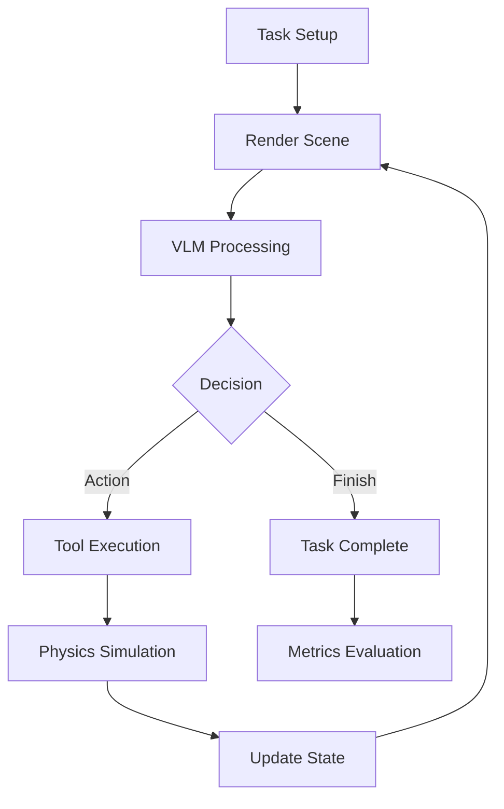

# VisualReasonBench - PhyVPuzzle Framework

A comprehensive framework for physical visual reasoning tasks combining vision-language models (VLMs) with physics simulation environments.

## 🎯 Overview

PhyVPuzzle is a benchmark framework that evaluates the ability of AI models to solve physical reasoning tasks through visual perception and action planning. The system integrates:

- **Vision-Language Models (VLMs)**: GPT-4o and other models for visual understanding
- **Physics Simulation**: PyBullet for realistic 3D physics
- **Tool Calling**: Structured actions through function calling APIs
- **Multi-view Rendering**: Multiple camera angles for better scene understanding
- **Comprehensive Metrics**: Detailed evaluation including accuracy, efficiency, and token usage

## 🚀 Quick Start

### Installation

```bash
# Clone the repository
git clone https://github.com/your-org/VisualReasonBench.git
cd VisualReasonBench

# Install dependencies
pip install -r requirements.txt
```

### Environment Setup

```bash
# Set API credentials
export OPENAI_API_KEY="your-api-key"
export base_url="https://openai.app.msh.team/v1"  # Or your API endpoint
```

### Run a Simple Task

```bash
# Run domino task with GPT-4o
phyvpuzzle run --task-type dominoes --difficulty easy --vllm-model gpt-4o

# Evaluate multiple runs
phyvpuzzle evaluate --task-type dominoes --num-runs 3 --vllm-model gpt-4o
```

## 📁 Project Structure

```
VisualReasonBench/
├── src/phyvpuzzle/
│   ├── core/                      # Core pipeline components
│   │   ├── pipeline.py            # Main execution pipeline
│   │   ├── vllm_processor.py      # VLM integration
│   │   ├── action_descriptor.py   # Action parsing
│   │   └── translator.py          # Action to command translation
│   ├── environment/               # Physics environments
│   │   ├── physics_env.py         # PyBullet environment
│   │   └── phobos_models/         # 3D models and URDFs
│   ├── tasks/                     # Task implementations
│   │   ├── base_task.py           # Base task interface
│   │   ├── domino_task.py         # Domino toppling task
│   │   └── domino_tools.py        # Domino-specific tools
│   ├── evaluation/                # Evaluation metrics
│   │   └── metrics.py             # Metric calculations
│   ├── utils/                     # Utilities
│   │   ├── multi_view_renderer.py # Multi-view rendering
│   │   ├── token_calculator.py    # Token usage calculator
│   │   └── logger.py              # Experiment logging
│   └── cli.py                     # Command-line interface
├── configs/                        # Configuration files
├── experiments/                    # Experiment logs
└── README.md                       # This file
```

## 🔄 Pipeline Architecture

### Execution Flow



### Code Flow Mapping

#### 1. **Task Initialization**
```python
# src/phyvpuzzle/cli.py:run_task()
task_config = TaskConfiguration(...)
task = DominoTask(task_config)  # src/phyvpuzzle/tasks/domino_task.py
```

#### 2. **Pipeline Setup**
```python
# src/phyvpuzzle/core/pipeline.py:PhysicalReasoningPipeline
pipeline = PhysicalReasoningPipeline(config)
pipeline.initialize_components()  # Line 93-127
```

#### 3. **Main Execution Loop**
```python
# src/phyvpuzzle/core/pipeline.py:execute_task()
while not task.is_task_finished():  # Line 159-172
    step_result = self._execute_single_step()  # Line 163
```

#### 4. **Single Step Execution**
```python
# src/phyvpuzzle/core/pipeline.py:_execute_single_step()
# Line 210-430: Complete step execution
1. Render scene (Line 219-230)
2. Process with VLM (Line 243-274)
3. Parse decision (Line 276-287)
4. Execute tools/actions (Line 295-384)
5. Update feedback (Line 432-445)
```

#### 5. **VLM Processing**
```python
# src/phyvpuzzle/core/vllm_processor.py:OpenAIVLLMProcessor
def process_input(self, image, task_description, context, tools):
    # Line 193-292: Process image and get model response
    # Handles both text and tool calls
```

#### 6. **Tool Execution**
```python
# src/phyvpuzzle/tasks/domino_tools.py:DominoTools
def execute_tool(self, tool_name, arguments):  # Line 88-102
    # Executes push_domino, check_dominoes, or finish_task
    
# src/phyvpuzzle/environment/physics_env.py:PyBulletEnvironment
def execute_tool_call(self, name, args):  # Line 638-670
    # Routes tool calls to appropriate handlers
```

#### 7. **Physics Simulation**
```python
# src/phyvpuzzle/environment/physics_env.py:PyBulletEnvironment
def step(self):  # Line 771-774
    p.stepSimulation()  # PyBullet physics step
```

#### 8. **Multi-View Rendering**
```python
# src/phyvpuzzle/utils/multi_view_renderer.py:MultiViewRenderer
def render_multi_view(self):  # Line 84-123
    # Renders from 4 viewpoints: top, front, front-top, side
    # Combines into 2x2 grid with labels
```

#### 9. **Metrics Evaluation**
```python
# src/phyvpuzzle/evaluation/metrics.py
AccuracyMetric.evaluate()      # Line 45-59
PassAtKMetric.evaluate()        # Line 69-88
AvgStepMetric.evaluate()        # Line 128-142
DistanceToOptimalMetric.evaluate()  # Line 151-215
```

#### 10. **Token Calculation**
```python
# src/phyvpuzzle/utils/token_calculator.py:QwenTokenCalculator
def analyze_conversation():  # Line 102-139
    # Counts tokens and calculates costs
```

## 🛠️ Key Components

### VLM Processor
Handles communication with vision-language models:
- **Location**: `src/phyvpuzzle/core/vllm_processor.py`
- **Key Methods**:
  - `process_input()`: Send image and prompt to model
  - `_prepare_messages()`: Format messages with base64 images
  - `_parse_response()`: Extract tool calls and text

### Physics Environment
PyBullet-based 3D physics simulation:
- **Location**: `src/phyvpuzzle/environment/physics_env.py`
- **Key Methods**:
  - `render()`: Capture scene images (single or multi-view)
  - `execute_tool_call()`: Execute physics actions
  - `get_tool_schemas()`: Provide tool definitions to VLM

### Task System
Modular task implementations:
- **Base**: `src/phyvpuzzle/tasks/base_task.py`
- **Example**: `src/phyvpuzzle/tasks/domino_task.py`
- **Tools**: `src/phyvpuzzle/tasks/domino_tools.py`

### Metrics System
Comprehensive evaluation metrics:
- **Location**: `src/phyvpuzzle/evaluation/metrics.py`
- **Metrics**:
  - Accuracy: Task success rate
  - Pass@K: Success within K attempts
  - Distance to Optimal: Step efficiency
  - Token Efficiency: Token usage analysis

## 📊 Metrics Output Example

```
================================================================================
                        METRICS EVALUATION REPORT
================================================================================

📋 Task Information:
   Task: DominoTask
   Model: gpt-4o

📊 Performance Metrics:
   ✅ Success: Yes
   📈 Score: 100.00%
   🎯 Dominoes Toppled: 5/5

⚡ Efficiency Metrics:
   🔢 Steps Taken: 1
   🎯 Optimal Steps: 1
   📏 Distance to Optimal: 0
   📊 Efficiency Ratio: 1.00x
   ⏱️ Time Taken: 3.45s

💬 Token Usage:
   📥 Input Tokens: 2,500
   📤 Output Tokens: 450
   📊 Total Tokens: 2,950
   💰 Estimated Cost: $0.0193
```

## 🔧 Configuration

### Pipeline Configuration
```python
config = PipelineConfig(
    vllm_type="openai",           # VLM type
    vllm_model="gpt-4o",          # Model name
    environment_type="pybullet",  # Physics engine
    gui=False,                    # Show GUI
    max_iterations=10,            # Max steps
    timeout=60.0                  # Timeout (seconds)
)
```

### Task Configuration
```python
task_config = TaskConfiguration(
    task_type=TaskType.DOMINOES,
    difficulty=TaskDifficulty.EASY,
    parameters={
        "num_dominoes": 5,
        "layout": "line",
        "spacing": 0.12
    }
)
```

## 🧪 Testing

### Run Tests
```bash
# Test multi-view rendering
python test_multiview_rendering.py

# Test metrics output
python test_metrics_output.py

# Test complete evaluation
python evaluate_with_metrics.py
```

### Debugging
```bash
# Enable verbose logging
export LOG_LEVEL=DEBUG

# Run with GUI for visualization
phyvpuzzle run --task-type dominoes --gui --vllm-model gpt-4o
```

## 📈 Experiment Tracking

Experiments are automatically logged to `experiments/` directory:
```
experiments/
├── gpt-4o_DominoTask_20240815_142530/
│   ├── trial_info.json         # Trial metadata
│   ├── round_1/                # Per-round data
│   │   ├── input.json          # Model input
│   │   ├── output.json         # Model output
│   │   ├── pre_action.png      # Scene before action
│   │   └── post_action.png     # Scene after action
│   └── round_2/
│       └── ...
```

## 🤝 Contributing

1. Fork the repository
2. Create a feature branch
3. Implement your changes
4. Add tests
5. Submit a pull request

## 📄 License

This project is licensed under the MIT License.

## 📚 Citation

If you use this framework in your research, please cite:
```bibtex
@software{phyvpuzzle2024,
  title={PhyVPuzzle: A Framework for Physical Visual Reasoning},
  author={Your Team},
  year={2024},
  url={https://github.com/your-org/VisualReasonBench}
}
```

## 🔗 Related Projects

- [PyBullet](https://pybullet.org/): Physics simulation
- [OpenAI API](https://platform.openai.com/): Vision-language models
- [tiktoken](https://github.com/openai/tiktoken): Token counting

## 📞 Contact

For questions and support, please open an issue on GitHub or contact the maintainers.